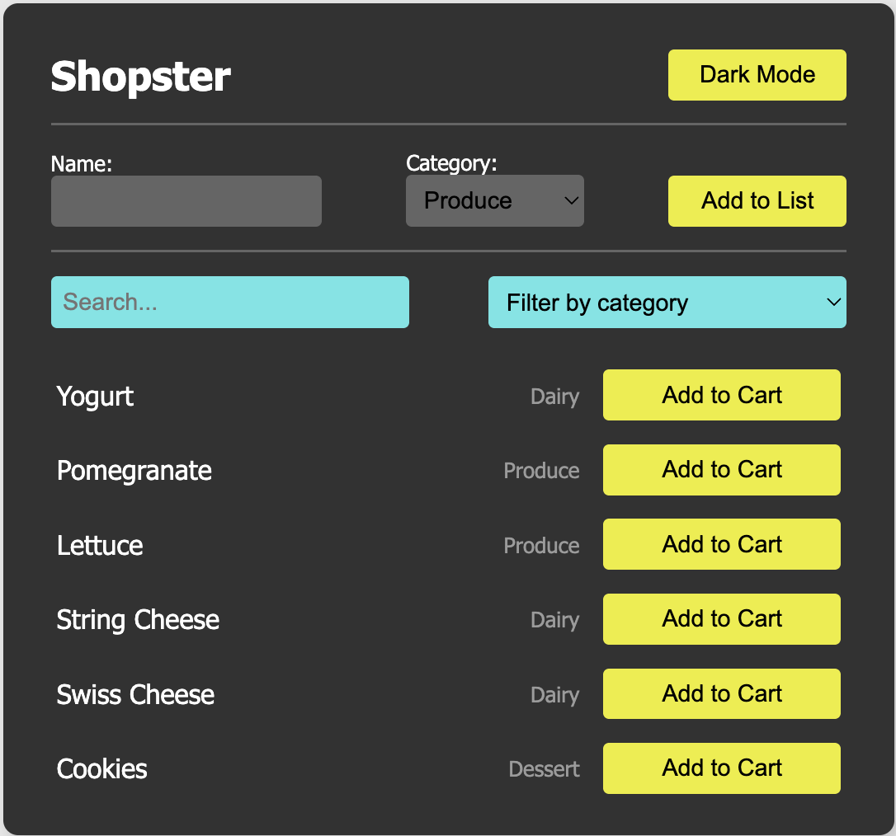

# Shopping Forms Lab

Project Description:
This React application is a controlled-components lab that extends a basic Shopping List app with two key features:

Advanced Search & Filter: Dynamically filter items by name (full and partial matches) and by category (All/Produce/Dairy/Dessert).

Add New Item Form: Use a controlled form to create and append new shopping items with a unique id, name, and category.

All form inputs are fully controlled via React useState hooks, and the state is lifted to the appropriate components to ensure a unidirectional data flow.

## Table of Contents

- [Demo](#demo)  
- [Setup](#setup)  
- [Testing](#testing)
- [Features](#features)
---

## Demo

## Setup
1. Clone the repo
2. `npm install`
3. `npm start` 
4. Follow link to view site

## Testing
- Run `npm test` to execute the Jest suite.

## Features

Dynamic Search: As you type in the search bar, item list updates in real time.

Category Filter: Select a category dropdown to narrow down shown items.

Add Item: Controlled form to add new items. Automatically resets after submission.

Dark/Light Mode: Toggle the UI theme using the button in the header.